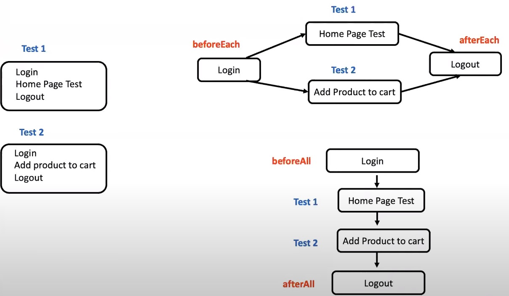

## Implementation of hooks in playwright with JavaScript

Hooks play a crucial role in test automation as they allow QA Engineers to execute custom code at various points during the test lifecycle.
Understanding and utilizing hooks effectively can greatly enhance the robustness and efficiency of test suites.

### Hooks in playwright
   1. beforeEach = This hook is executed before each individual test
   2. afterEach = This hook is executed after each individual test
   3. beforeAll = This hook is executed only once before any of the tests start running
   4. afterAll: This hook is executed only once after all the tests have been run

### Test files
1. hooks1.spec.js = In this test file, we have implemented tests without using any hooks
2. hooks2.spec.js = In this test file we have implemented the same tests using beforeEach & afterEach hooks
3. hooks3.spec.js = In this test file we have implemented the same tests using beforeAll & afterAll hooks

#### This image may help us better understand hooks

